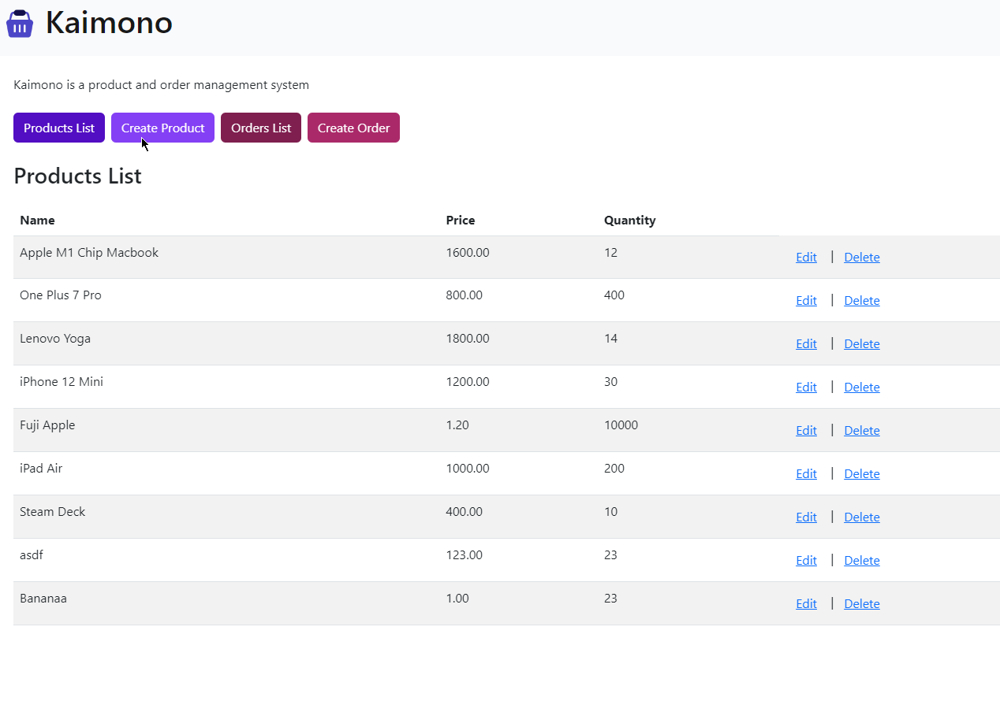

# Kaimono
A product and order management system based on the MERN stack.

See deployed app here: https://cerulean-macaron-9639ad.netlify.app/

## Tech stack
Front-end: React, React Router, Bootstrap
Back-end: Express, NodeJS, MongoDB
Hosting: Netlify (Front-end), Heroku (Back-end), MongoDB Atlas (Database)
CI/CD: Github actions

### Front-end
React was chosen for the front-end because it allows for clear segregation of reusable components. React Router makes routing easier. Bootstrap allows us to create responsive front-end designs quickly without having to write CSS manually. It is good for prototyping.

### Back-end
MongoDB was chosen because a NoSQL database allows us to scale it horizontally in view of big data. Scaling a database horizontally is easier, faster and more cost effective as compared to scaling it vertically. The downside is that we lose the ability to make use of relational tables for fast query of data.

### CI/CD
Adopting a microservices architecture, the front and back-end are in separate folders and deployed separately. `react-client` is deployed to Netlify and `server` is deployed to Heroku. Heroku connects to MongoDB Atlas where the data is stored.

The main advantage with this approach is flexibility. With the front-end independent from the back, we can work on it or scale it without having to redeploy the entire application. This also allows us to reduce overall website downtime.

Setting up Github actions allows us to do this easily. The only downside to the current implementation is that `npm run build` within the `react-client` folder has to be executed locally instead of doing it with Github Actions.

## Other Considerations
I've not implemented caching but if there is a need to, I am thinking of looking into Redis for caching requests and Cloudfront for caching static assets.

## Running it locally
Pre-requisites: have nodejs installed
1. Open 2 terminal, first into `react-client`, second into `server`
2. Create `.env` in `react-client` with the url defined and `config.env` in `server` with the ATLAS url defined.
3. Run `npm start` on both.